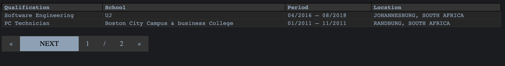

Dead simple react table

[](https://www.npmjs.com/package/ds-react-table) [](https://github.com/julekgwa/ds-react-table) [](https://unpkg.com/ds-react-table/dist/index.js)  


## Installation

```bash
$ npm install ds-react-table
```

or

```bash
$ yarn add ds-react-table
```

## Usage

```Javascript
import React from 'react';

import { Table } from 'ds-react-table';

const data = [
  {
    qualification: 'Software Engineering',
    school: 'UJ',
    period: '04/2016 – 08/2018',
    location: 'JOHANNESBURG, SOUTH AFRICA',
  },
  {
    qualification: 'PC Technician',
    school: 'Boston City Campus & business College',
    period: '01/2011 – 11/2011',
    location: 'RANDBURG, SOUTH AFRICA',
  },
  {
    qualification: 'UX Designer',
    school: 'UCT',
    period: '01/2008 – 12/2010',
    location: 'CAPE TOWN, SOUTH AFRICA',
  }
];

function App() {
  return (
    <div className="App">
      <Table
        dataLimit={15}
        sort={false}
        showPagination={true}
        data={data}
      />
    </div>
  );
}

export default App;
```


## API

| Prop           | Type             | Default   | Description                                                                           |   |
|----------------|------------------|-----------|---------------------------------------------------------------------------------------|---|
| data      | array             | Required     | Array of objects to be displayed in a table |   |
| sort        | bool             | false  |  To enable sorting                                       |   |
| dataLimit       | number             | 10  | The number of items to be shown on each page.                                                    |   |
| showPagination | bool             | false     | Show/hide pagination                                   |   |

## Styling the table and pagination

```css
/* table.module.css */
body {
  background: #1d1e22;
}
/* styling the table */
table, td {
  border: 1px solid #353535;
  padding-left: 5px;
}

th {
background-color: #3B3B3B;
text-align: left;
padding-left: 5px;
}

table {
  width: 100%;
  font-family: monospace;
  border-collapse: collapse;
  background-color: #2B2B2B;
  color: #94ABBE;
}

/* styling pagination */

.pagination {
  display: inline-block;
  background-color: white;
  border: 1px solid #d8cdc9;
  margin-top: 10px;
}

.pagination a {
  color: black;
  float: left;
  padding: 8px 16px;
  text-decoration: none;
}
.pagination a:not(:nth-child(2)) {
  background-color: #d8cdc9;
  color: white;
}

.pagination a:nth-child(2) {
  display: inline-block;
  width: 100px;
  text-align: center;
}

.pagination a:nth-child(n+3):nth-last-child(n+2) {
  cursor: default;
}
```

```Javascript
import React from 'react';

import { Table } from 'ds-react-table';

// import css file

import './table.module.css';

function App() {
  return (
    <div className="App">
      <Table
        dataLimit={2}
        sort={false}
        showPagination={true}
        data={data}
      />
    </div>
  );
}

export default App;
```



## BYOP (bring your own pagination)

This example uses [rc-pagination](https://github.com/react-component/pagination)
```Javascript
import React, {useState}> from 'react';

import { Table } from 'ds-react-table';

import Pagination from 'rc-pagination';
import 'rc-pagination/assets/index.css';

function App() {
  const countPerPage = 2;
  const [currentPage, setCurrentPage] = useState(1);
  const [collection, setCollection] = useState(data.slice(0, countPerPage));

  const updatePage = (p) => {

    setCurrentPage(p);
    const to = countPerPage * p;
    const from = to - countPerPage;
    setCollection(data.slice(from, to));

  };

  return (
    <>
      <Table dataLimit={collection.length} data={collection} />

      <Pagination
        pageSize={countPerPage}
        onChange={updatePage}
        current={currentPage}
        total={data.length}
      />
    </>
  );
});
```


## License

MIT
